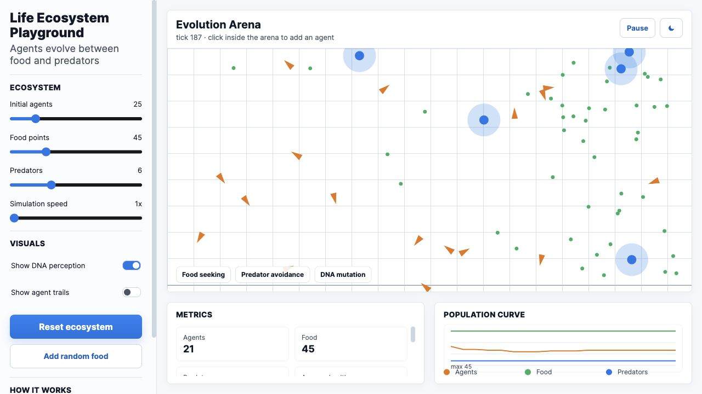

# Life Ecosystem Playground

Standalone ecosystem simulation with agents, food, predators, reproduction, health, and population charts.

## Live Demo

[Open the Vercel deployment](https://life-pearl-one.vercel.app)



## Features

- Agents search for food, avoid predators, reproduce, and die from starvation or capture.
- Adjustable population, food, predators, speed, debug overlays, and trails.
- Live metrics for health, births, deaths, and population history.
- Single-file static app, deployable without a backend.

## Run Locally

```bash
python3 -m http.server 8773
```

Then open:

```text
http://localhost:8773
```

## Project Structure

```text
index.html       Full standalone simulator
docs/            README screenshot assets
```
